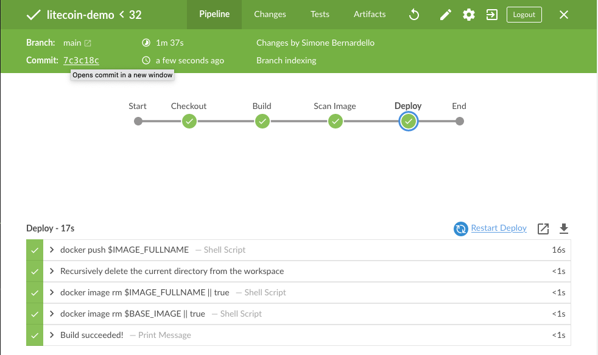
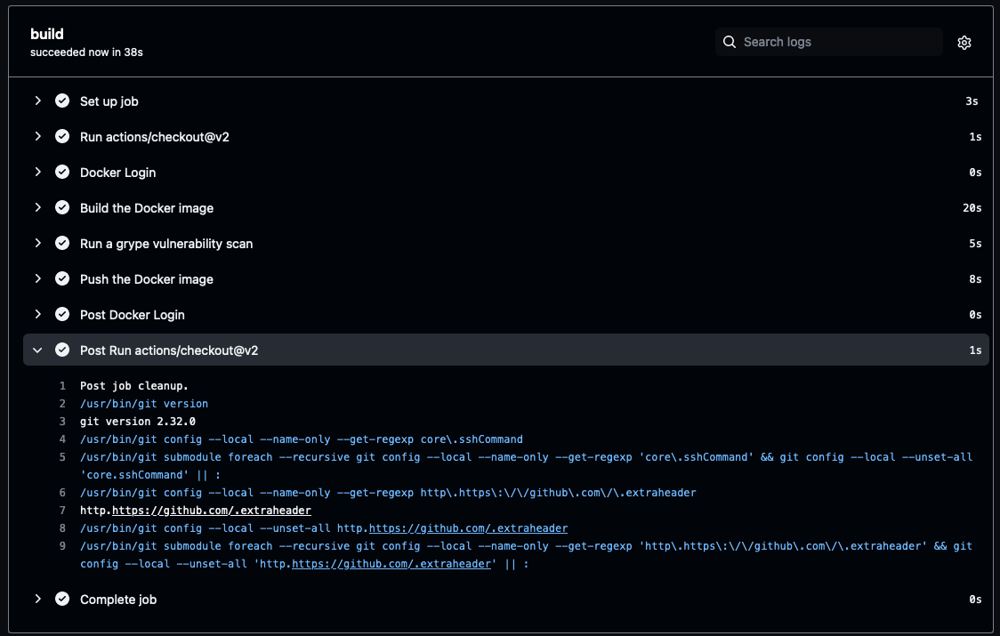

# Step 3

## Jenkins

This Jenkinsfile pipeline builds the image, scan for critical issues using grype (archiving scan results as an artifact) and push image to public Docker registry.

## GitHub Actions example

Used as a starting template [this](https://betterprogramming.pub/docker-container-security-with-anchore-grype-6913bc926499) and adapted to the requested project.

As a result a github action builds the image, scan it an push it to dockerhub registry.

