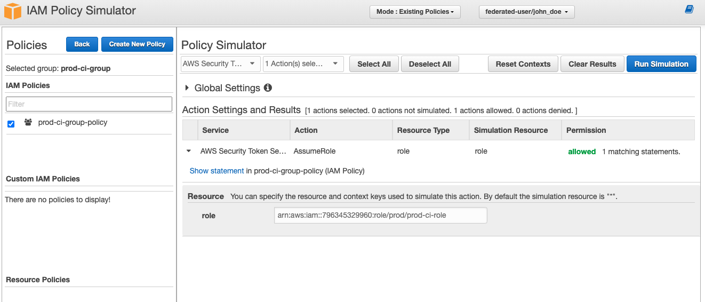

# Step 6 (Terraform)

## Description

This is deployed using [terragrunt](https://github.com/gruntwork-io/terragrunt) a thin wrapper for Terraform that supports locking and enforces best.

The `terragrunt.hcl` contains the values of vars used by the module:

```terraform
inputs = {
  aws_account_id = "111111111111"  # This is the AWS account ID the role is deployed
  username       = "john_doe_1"    # A username with this name will be created and added to the proper group
  name_prefix    = "prod"          # Customize the prefix of created objects
  path           = "/prod/"        # Custom path for IAM path
}
```

### Module ci-access

This module create the required iam policies, group and user.


### Results

Using IAM Policy Simulator to test the result:


